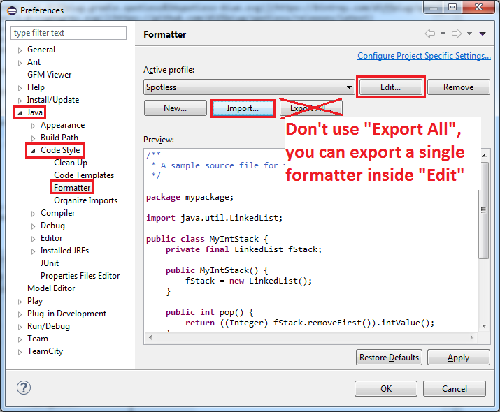
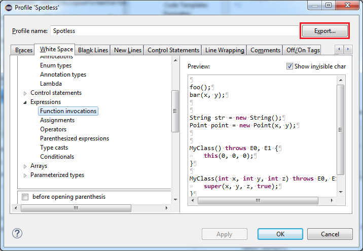

# Spotless: Keep your code spotless with Gradle


[](https://github.com/diffplug/spotless/releases/latest)
[](https://github.com/diffplug/spotless/tree/develop)
[](https://travis-ci.org/diffplug/spotless)
[](https://tldrlegal.com/license/apache-license-2.0-(apache-2.0))

# PREPPING FOR RELEASE - NOT YET READY FOR USE!

Spotless can check and apply formatting for any plain-text file, with special support for Java.  It supports several formatters out of the box, including:

* Java style and import ordering (using Eclipse's code formatter)
* License headers
* Tabs vs spaces, trailing whitespace, end with newline, generic regex
* Any user-defined string that takes an unformatted string and outputs a formatted version.

Even if you don't use Eclipse, or even Java, Spotless makes it painless to find and correct formatting errors:

```
cmd> gradlew build
   ...
:spotlessJavaCheck FAILED
> Format violations were found. Run 'gradlew spotlessApply' to fix them.
    src\test\java\com\diffplug\gradle\spotless\ResourceTest.java

cmd> gradlew spotlessApply
:spotlessApply
BUILD SUCCESSFUL

cmd> gradlew build
BUILD SUCCESSFUL
```

If you want to audit what `spotlessApply` will do to your code:
* Save your working tree with `git add -A`, then `git commit -m "Checkpoint before spotless."`.
* Run `gradlew spotlessApply`.
* View the changes with `git diff`.
* If you don't like what spotless did, `git reset --hard`.
* If you'd like to remove the "checkpoint" commit, `git reset --soft head~1` will make the checkpoint commit "disappear" from history, but keeps the changes in your working directory.

## Adding spotless to Java source

```groovy
buildscript {
	repositories {
		jcenter()
	}
	dependencies {
		classpath 'com.diffplug.gradle.spotless:spotless:1.0'
	}
}

apply plugin: 'java'
...

apply plugin: 'com.diffplug.gradle.spotless'
spotless {
	java {
		licenseHeader '/** Licensed under Apache-2.0 */'	// License header
		licenseHeaderFile 'spotless.license.java'			// License header file
		// Obviously, you can't specify both licenseHeader and licenseHeaderFile at the same time

		importOrder ['java', 'javax', 'org', 'com', 'com.diffplug']	// An array of package names
		importOrderFile 'spotless.importorder.properties'	// An import ordering file, exported from Eclipse
		// As before, you can't specify both importOrder and importOrderFile at the same time

		eclipseFormatFile 'spotless.eclipseformat.xml'	// XML file dumped out by the Eclipse formatter
		// If you have an older Eclipse properties file, you can use that too.

		// You can also tweak the formatting with custom regexes or functions, such as:
		// Eclipse formatter puts excess whitespace after lambda blocks
		//    funcThatTakesLambdas(x -> {} , y -> {} )	// what Eclipse does
		//    funcThatTakesLambdas(x -> {}, y -> {})	// what I wish Eclipse did
		custom 'Lambda fix', { it.replace('} )', '})').replace('} ,', '},') }

		// By default, all Java source sets will be formatted.  To change
		// this, set the 'target' parameter as described in the next section.
	}
}
```

## Adding spotless to other source

Spotless has a generic system for specifying which transformations to apply to which files. This makes it easy to apply simple formatting rules (indentation, trailing whitespace, etc) to all of your source plaintext.

```groovy
spotless {
	// this will create two tasks: spotlessGradleCheck and spotlessGradleApply
	format 'gradle' {
		// target determines which files this format will apply to
		// - if you pass a string or a list of strings, they will be treated
		//       as 'include' parameters to a fileTree in the root directory
		// - if you pass a FileCollection, it will pass through untouched
		//       e.g. project.files('build.gradle', 'settings.gradle')
		// - if you pass anything else, it will be sent to project.files(yourArg)
		target '**/*.gradle'

		// spotless has built-in rules for the most basic formatting tasks
		indentWithTabs() // or spaces. Takes an integer argument if you don't like 4
		trimTrailingWhitespace()
		endWithNewline()
	}

	format 'cpp' {
		target '**/*.hpp', '**/*.cpp'

		// you can add simple replace rules
		customReplace      'Not enough space after if', 'if(', 'if ('
		// or complex regex rules
		customReplaceRegex 'Too much space after if', 'if +\\(', 'if ('

		// Everything before the first #include or #pragma will be replaced with the header
		licenseHeaderFile 'spotless.license.cpp', '#'
		// The '#' is treated as regex which is applied to each line, so you can
		// make a more complex header delimiter if you require it

		// you can also call out to your own function
		custom 'superFormatter', {
			// when writing a custom step, it will be helpful to know
			// how the formatting process works, which is as follows:

			// 1) Load each target file, and convert it to unix-style line endings ('\n')
			// 2) Pass its content through a series of steps, feeding the output of each step to the next
			// 3) Put the correct line endings back on, then either check or apply

			// each step receives a string as input, and should output
			// a formatted string as output.  Each step can trust that its
			// input will have unix newlines, and it must promise to output
			// only unix newlines.  Other than that, anything is fair game!
		}
	}

	// If you'd like to specify that files should always have a certain line ending, you can,
	// but the default value of PLATFORM_NATIVE is *highly* recommended
	lineEndings = PLATFORM_NATIVE 	// can be WINDOWS, UNIX, or PLATFORM_NATIVE
}
```

See [`FormatExtension.java`](https://github.com/diffplug/spotless/blob/master/src/main/java/com/diffplug/gradle/spotless/FormatExtension.java) for further details on the default rules.

See [`JavaExtension.java`](https://github.com/diffplug/spotless/blob/master/src/main/java/com/diffplug/gradle/spotless/java/JavaExtension.java) for further details on how the Java formatter is implemented.

## Acknowledgements

* Formatting by Eclipse 4.5 M6
    + Special thanks to [Mateusz Matela](https://waynebeaton.wordpress.com/2015/03/15/great-fixes-for-mars-winners-part-i/) for huge improvements to the eclipse code formatter!
* Forked from [gradle-license-plugin](https://github.com/youribonnaffe/gradle-format-plugin) by Youri Bonnaffé.
* Import ordering from [EclipseCodeFormatter](https://github.com/krasa/EclipseCodeFormatter).
* Formatted by [spotless](https://github.com/diffplug/spotless).
* Built by [gradle](http://gradle.org/).
* Tested by [junit](http://junit.org/).
* Artifacts hosted by [jcenter](https://bintray.com/bintray/jcenter) and uploaded by [gradle-bintray-plugin](https://github.com/bintray/gradle-bintray-plugin).

## Exporting / importing from Eclipse

There are two files to import / export with Eclipse - the import ordering file and the code formatting file.

### Opening the preferences


### Creating `spotless.eclipseformat.xml`



Eclipse formatter's off / on tags are often overlooked:


### Creating `spotless.importorder.properties`

